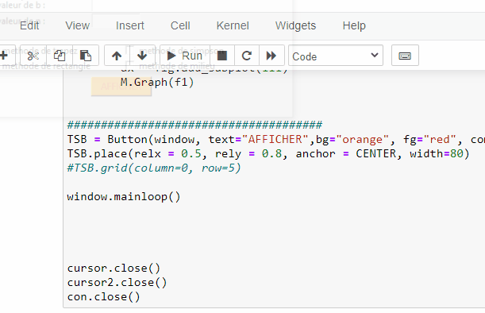
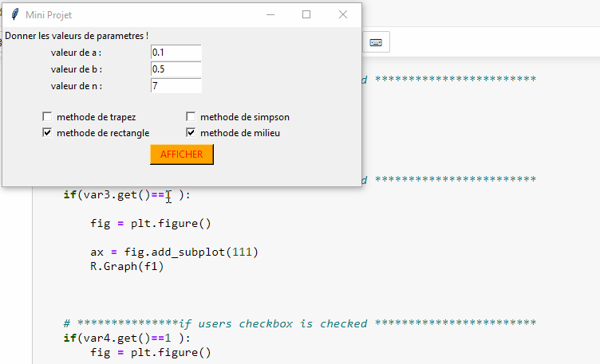

# Lancer  le projet 

le mini projet consiste à gérer des méthodes (trapèze, rectangle, milieu et simpson).
J'ai créé 3 champs de texte pour entrer les valeurs de a, b etn et 4 cases à cocher pour
 choisir les courbes associées à la méthode souhaitée et un bouton pour afficher les courbes
vous pouvez afficher 1, 2, 3 ou 4 courbes en même temps

# La démonstration de chaque graphe a part 
 

 
# La démonstration de quatre graphes ensemble

 

